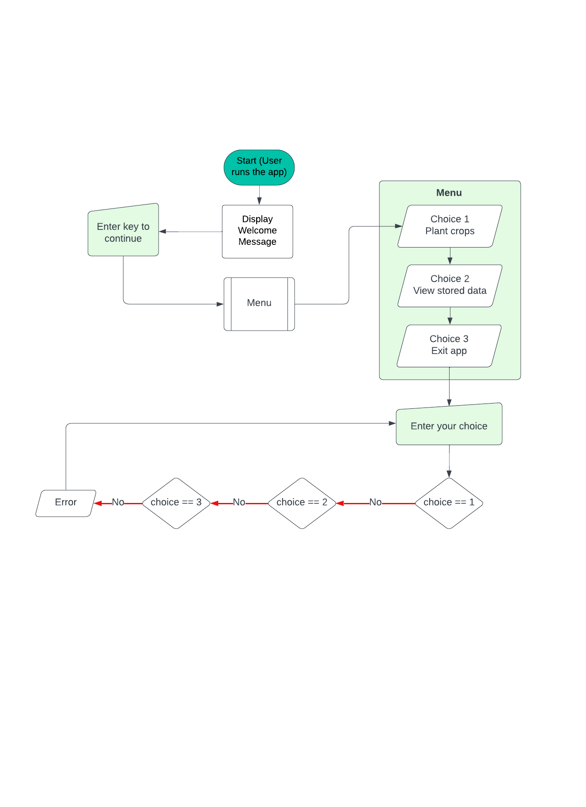

# Crop Calendar Planner
## Introduction

### Project Description
[Crop Calendar](https://crop-calendar-89946e6c5172.herokuapp.com/)
The Crop Calendar Planner is an application designed to help users plan their planting and harvesting times efficiently. Whether you're a seasoned gardener or just starting out, this tool will guide you through the process of choosing the best dates for planting and harvesting your crops.

### Project Purpose
The aim of this project is to create a practical tool for gardeners to plan their planting and harvesting schedules. The application provides a simple interface to select crops and calculate the best dates for planting and harvesting based on various growth stages.

## User Stories
The Crop Calendar Planner is designed to provide an efficient and easy-to-use experience for gardeners looking to plan their crop schedules.

### Gardener
**User story:** As a gardener, I want a clear and easy-to-understand interface so that I can quickly plan my planting and harvesting schedules.

**End user goal:** I can easily start a new planning session, select my crops, and receive a detailed schedule for planting and harvesting.

### Flowchart
Flowcharts for Crop Calendar Planner

The Crop Calendar Planner application helps users plan their planting and harvesting schedules efficiently. The flowcharts below illustrate the various processes involved in the application, from user interactions to data processing and storage. Each flowchart is explained in detail to provide a comprehensive understanding of the application's workflow.
### 1. User Interaction Flowchart

<details>
<summary>Flowchart - Menu (image of)</summary>


</details>


**Description**:
This flowchart outlines the steps a user takes to interact with the Crop Calendar Planner application. It begins with the user launching the application and navigating through various options.

- **Start (User runs the app)**: The user launches the application.
- **Display Welcome Message**: The application displays a welcome message and brief introduction.
- **Menu**: The user is presented with a main menu with three options: 
  - **Choice 1**: Plan crops
  - **Choice 2**: View stored data
  - **Choice 3**: Exit app
- **Enter your choice**: The user inputs their choice.
  - **Choice 1 == 1**: The user selects to plan crops.
  - **Choice 1 == 2**: The user selects to view stored data.
  - **Choice 1 == 3**: The user selects to exit the app.
  - **Error**: If the user input is invalid, an error is shown.

### 2. Plan Crops Flowchart

<details>
<summary>Flowchart - Plan Crops (image of)</summary>


</details>

**Description**:
This flowchart details the process of planning crops, including selecting plants and calculating planting and harvesting dates.

- **Plan crop**: The user starts the crop planning process.
- **Plant table**: The application displays a table of available plants.
- **Choose plant/plants**: The user selects one or more plants from the table.
  - **Valid input**: Checks if the user input is valid.
  - **No**: If the input is invalid, the user is prompted to re-enter.
- **Plan for plant seeds or harvest (P/H)**: The user decides whether to plan for planting seeds or harvesting.
- **Enter Date**: The user enters the desired date.
  - **Valid date**: Checks if the entered date is valid.
  - **No**: If the date is invalid, the user is prompted to re-enter.
- **Display result**: The application calculates and displays the results based on the entered date and chosen action.
- **Store data (Y/N)**: The user is asked if they want to store the calculated data.
  - **Yes**: The user opts to store the data.
    - **Enter Email**: The user enters their email address.
      - **Success**: If the email is valid, the data is stored successfully.
      - **No**: If the email is invalid, the user is prompted to re-enter.
    - **Store plant data**: The application stores the data.
  - **No**: If the user opts not to store the data, they return to the menu.
- **Enter key to continue**: The user can press enter to continue and return to the menu.

### 3. View Stored Data Flowchart

<details>
<summary>Flowchart - View Stored Data (image of)</summary>


</details>

**Description**:
This flowchart illustrates the process of retrieving and displaying stored data based on the user's email address.

- **View stored data**: The user starts the process to view stored data.
- **Email address**: The application prompts the user to enter their email address.
- **Enter email address**: The user enters their email address.
- **Matching data**: The application checks if there is data matching the entered email.
  - **Yes**: If matching data is found, it is displayed to the user.
  - **No**: If no matching data is found, the user is prompted to re-enter their email.
- **Display plant data**: The application displays the stored plant data associated with the user's email.
- **Enter key to continue**: The user can press enter to continue and return to the menu.


## Features

### Welcome screen
Intro to the app
    

### Menu

### Main Application Area
- **Plant Selection Area:** Displays the list of available plants for selection.
- **Schedule Display:** Shows the calculated planting and harvesting schedule.
- **User Input Area:** Allows users to input dates and actions for planning.


## Python Functionality

### Core Functions
- **clear_terminal():** Clears the terminal screen.
- **display_menu(options):** Displays a menu of options and returns the user's choice.
- **main_menu():** Displays the main menu and handles user selection.
- **welcome_message():** Displays the welcome message and introduction to the app.
- **plan_crops():** Function to plan crops by selecting plants and calculating dates.
- **view_stored_data():** Function to view stored data by entering the user's email.
- **select_plants():** Displays a table of plants and allows the user to select multiple plants by entering their numbers.
- **get_action():** Prompts the user to choose between entering a planting date or a harvest date.
- **get_date():** Prompts the user to enter a date and validate the format.
- **get_selected_plants(data, user_selection):** Calculates and displays planting or harvest dates based on user selection.
- **store_data_prompt(user_list_data):** Prompts the user to store data and handle the storage process.
- **store_results(email, results):** Stores the user's results in the 'user_results' worksheet.
- **fetch_user_data(email):** Fetches user data from the 'user_results' worksheet based on the provided email address.
- **display_user_data(user_data):** Displays the user's stored data in a formatted table.

## Modules

### plant.py
The `plant.py` module defines the `Plant` class and its subclasses, encapsulating the properties and behavior of different types of plants.

#### Plant Class
- **Attributes:**
  - `id`: Plant ID
  - `name`: Plant name
  - `category`: Plant category
  - `germination`: Germination time
  - `seedling_stage`: Seedling stage time
  - `vegetative_growth`: Vegetative growth time
  - `flowering_root_development`: Flowering/root development time
  - `fruit_development`: Fruit development time
  - `description`: Description of the plant

- **Methods:**
  - `parse_int(value)`: Converts a value to an integer, returns `None` if conversion fails.
  - `total_growth_time()`: Calculates the total growth time of the plant.
  - `summary()`: Provides a summary of the plant's attributes.

#### Subclasses
- **Legume**
- **RootVegetable**
- **FruitVegetable**
- **LeafyGreen**
- **Bulb**
- **Herb**

Each subclass inherits from the `Plant` class and initializes specific attributes relevant to the plant type.

### table_creator.py
The `table_creator.py` module defines the `TableCreator` class, which is responsible for creating and formatting tables for displaying plant data.

#### TableCreator Class
- **Attributes:**
  - `data_list`: The list of data including the header row.

- **Methods:**
  - `split_data()`: Splits the data into two columns.
  - `create_main_table()`: Creates and returns a `PrettyTable` with data split into two columns.

### user_data.py
The `user_data.py` module defines the `UserData` class, which encapsulates user data, including the email address and associated data entries, with proper encapsulation of the email attribute.

#### UserData Class
- **Attributes:**
  - `_email`: The user's email address (protected attribute).
  - `data`: The list of data entries for the user.

- **Methods:**
  - `__init__(self, email, data)`: Initializes the `UserData` instance with an email and data list.
  - `get_email(self)`: Returns the email address.
  - `add_data(self, data_entry)`: Adds a new data entry to the data list.
  - `get_data(self)`: Returns the list of data entries.

## Libraries Used

The Crop Calendar Planner application uses several external libraries. Below is a list of these libraries along with instructions on how to install them.

### Python Libraries

1. **gspread**
   - **Description**: A Python API for Google Sheets.
   - **Installation**: `pip3 install gspread`
   
2. **google-auth**
   - **Description**: Google Authentication Library.
   - **Installation**: `pip3 install google-auth`
   
3. **prettytable**
   - **Description**: A simple Python library for displaying tabular data in a visually appealing ASCII table format.
   - **Installation**: `pip3 install prettytable`

4. **platform**
   - **Description**: A module in Python's standard library for retrieving information about the platform on which the program is running.
   - **Installation**: This library is part of the Python Standard Library, so no installation is required.

5. **os**
   - **Description**: A module in Python's standard library for interacting with the operating system.
   - **Installation**: This library is part of the Python Standard Library, so no installation is required.

6. **datetime**
   - **Description**: A module in Python's standard library for working with dates and times.
   - **Installation**: This library is part of the Python Standard Library, so no installation is required.

## Installation

To install all the required libraries, you can use the following commands:

```bash
pip3 install gspread
pip3 install google-auth
pip3 install prettytable
```
## Testing

### Functionality Test (Manual Testing)
Tested across different devices and browsers to ensure the application works correctly.

#### Desktop Layout
|Feature|Expected result|Action|Status|
| --- | --- | --- | --- | 
|Plan Crops|Displays plant selection menu|Select "Plan crops" option|Pass|
|Select Plants|Displays selected plants|Enter valid plant numbers|Pass|
|Calculate Dates|Shows planting/harvesting schedule|Enter date and action|Pass|
|Store Data|Prompts for email and stores data|Enter email|Pass|
|View Stored Data|Displays stored data|Enter valid email address|Pass|

The test cases were carried out on following devices/browsers: 

- MacBook Pro
  - Firefox
  - Chrome


The tests were carried out on the finalized application; no errors were found.

### Code validation
#### Python
All files passed the CI Python Linter without errors

<details>
<summary>View Python validation results</summary>


</details>

### Performance test - Lighthouse

#### Desktop

<details>
<summary>Result start/home page</summary>


</details>


## Deployment - Heroku platform

The application is deployed on the Heroku platform.

follow the steps below to deploy

1. Login (or create an account at) to Heroku.
2. Click New and Create new app on the dashboard.
3. Enter a unique name and select the region and click Create app.
4. Within the created app select the tab Settings.
5. At the Config Vars section click Reveal Config Vars.
6. To use Google Sheets add a new config var with the key CREDS, for the value, paste the contents of the creds.json file.
7. Add another config var with the key PORT and the value 8000.
8. Below the Config Vars section click Add buildpack. Select Python and save. 
9. Then add another buildpack and select node.js. It is important that the buildpacks are shown in this order.
10. Navigate to the Deploy tab on top.
11. Select GitHub as the deployment method and connect to GitHub.
12. Search for the repository name of the project and click connect.
13. Optionally enable automatic deploys to deploy each time new code is pushed to the repository.
14. Click Deploy Branch to deploy the project .

### Local Development

#### How to Fork

To fork the repository:

1. Log in (or sign up) to GitHub.
2. Go to the repository for this project. [behemot-biz/crop-calendar](https://github.com/behemot-biz/crop-calendar)
3. Click the Fork button in the top right corner.

#### How to Clone

To clone the repository:

1. Log in (or sign up) to GitHub.
2. Go to the repository for this project. [behemot-biz/crop-calendar](https://github.com/behemot-biz/crop-calendar)
3. Click on the code button, select whether you would like to clone with HTTPS, SSH or GitHub CLI, and copy the link shown.
4. Open the terminal in your code editor and change the current working directory to the location you want to use for the cloned directory.
5. Type 'git clone' into the terminal and then paste the link you copied in step 3. Press enter.


## Technologies

**Programs used:**
- VSCode (Python development)
- Photoshop (edit images)

**Browsers:**
- Firefox
- Chrome

**Languages:**
- Python

**Web tools:**
- [GitHub](https://github.com) (repository)
- [Heroku platform](https://www.heroku.com/) (deployment platform)
- [CI Python Linter](https://pep8ci.herokuapp.com/#) (Python code validation)
- [Google Sheets](https://docs.google.com/spreadsheets) (data storage)
- [Google Sheets API](https://developers.google.com/sheets/api) (data interaction)
- [Lucidchart](https://lucid.app/) (flowshart creation)
- [Dillinger](https://dillinger.io) (Readme editor)

## Ideas for Future Implementation
- Display plant details
- Add notes to stored user data 
- 
- Advanced configuration options for crop planning
- Historical data analysis for improved scheduling

## Credits

### Code inspiration
- [PrettyTable Documentation](https://pypi.org/project/prettytable/) for table formatting
- [Google Sheets API Documentation](https://developers.google.com/sheets/api) for API interaction

**Readme guidance**

[README.md - How, What and When?](https://www.youtube.com/watch?v=l1DE7L-4eKQ)

**Thanks to my friends and family for testing the application and providing feedback.**

**Special thanks**
Special thanks to my mentor and fellow developers for their support and guidance throughout the project.

**Enjoy using the Crop Calendar Planner!**
